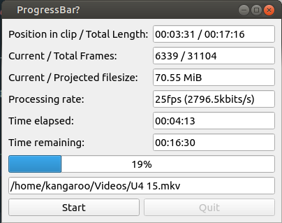

# Pyside6-QProcess-ffmpg process bar example

For a project i had in my head for a while i was pondering back and forth how to achieve an ffmpeg call and get a process report at the same time. The program of my dreams works headless / cli based and and in a gui mode, this solution only achieves the GUI mode and actually heavily leverages the signal abilities of the QT Library stuff. Starting point of my excursion was this blog post:
https://geoffsamuel.com/2020/03/16/the-qpower-of-qprocess/

To make it short, the magic is this:

```python
self.proc = QtCore.QProcess()
...
data = self.proc.readAllStandardError()
stderr = bytes(data).decode("utf8")
```

and the knowledge that the progress information of the ffmpeg library is on stderr. Everything else is fluff.

## Requirements

For its simple design this leverages quite some heavy libraries, namely `PySide6`, if you replace it 1:1 by `PySide2` it should work exactly the same as i did not utilize any new features. Further i use the handy [ffmpeg-python](https://github.com/kkroening/ffmpeg-python) hooks just to completly ignore the ffmpeg part and only take the tiny part that is `ffprobe` because i did not saw any reason to do my own handling of that output to achieve what others did before me.


TODO: write more text here Alan


shamelessly stolen design:


